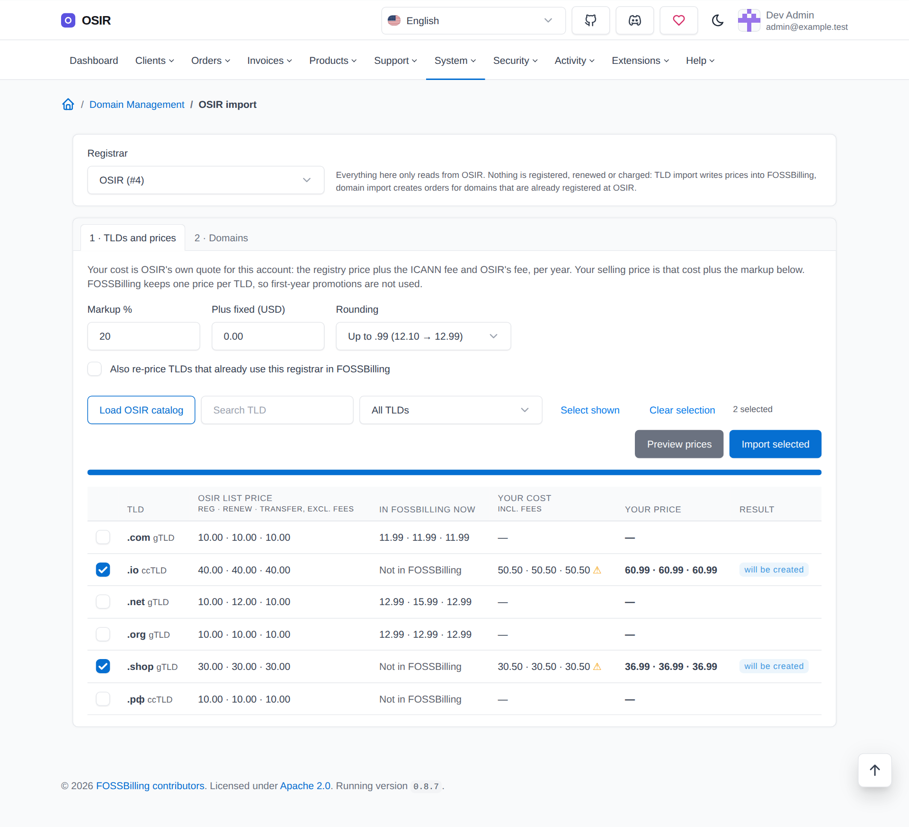
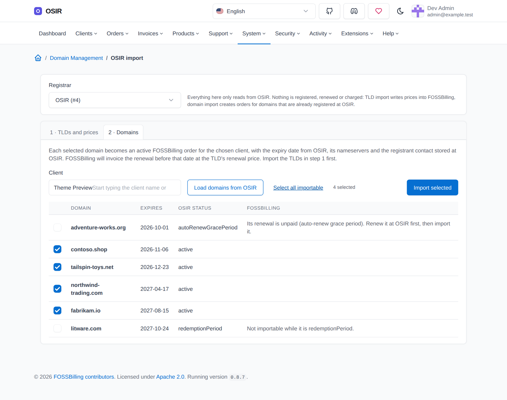
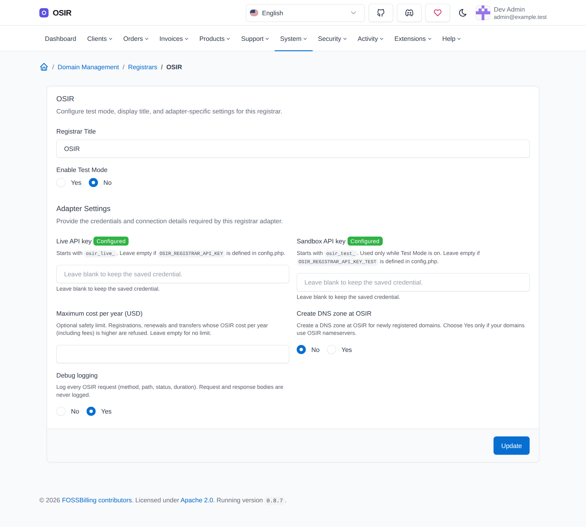
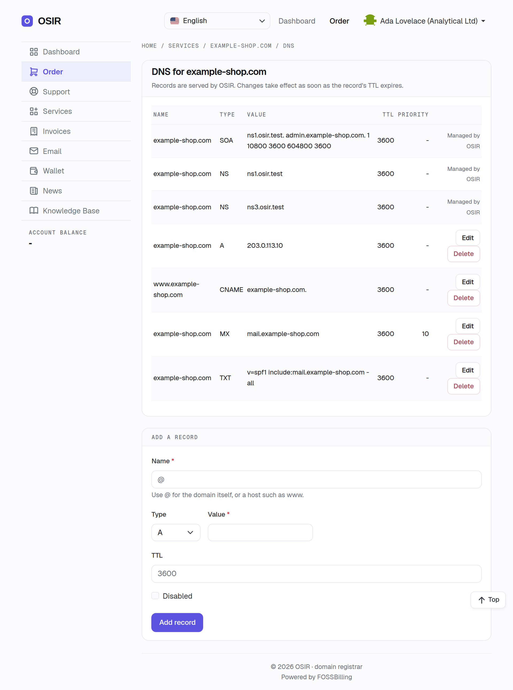
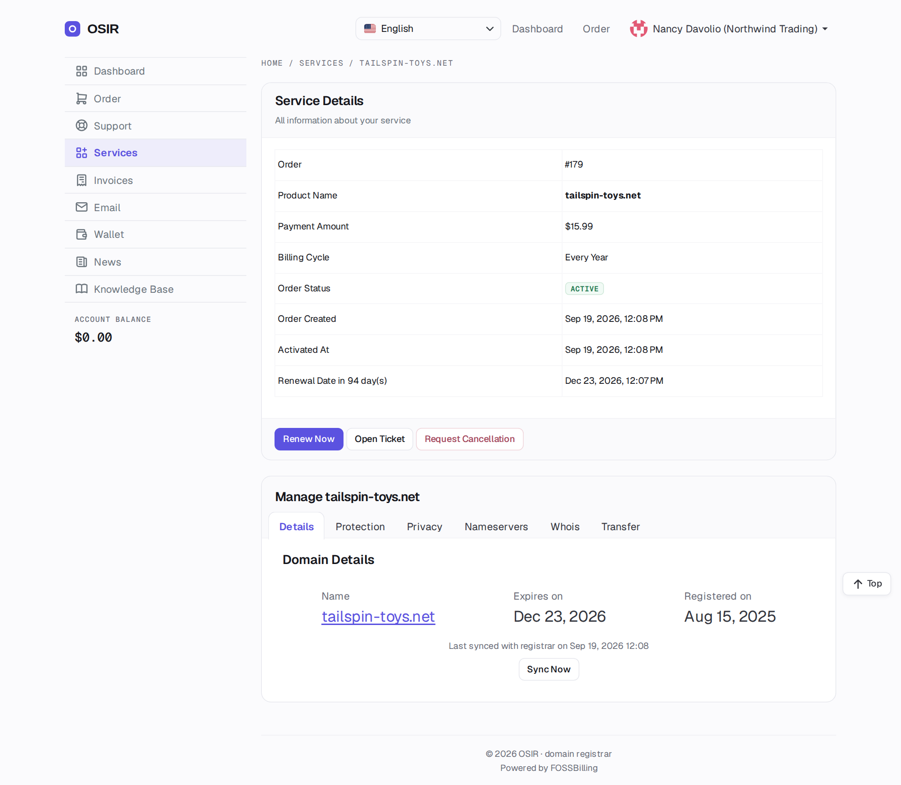
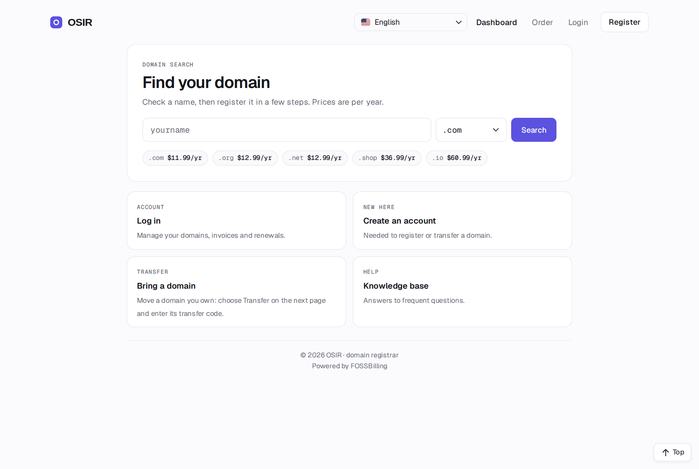
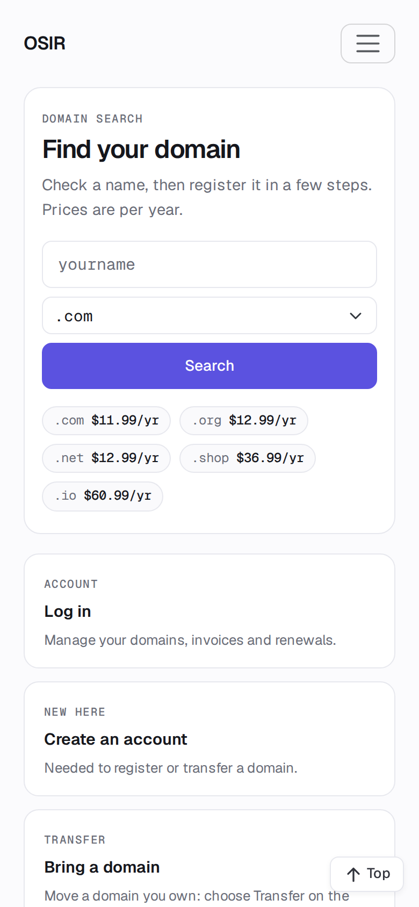

# OSIR registrar for FOSSBilling

Register, transfer, renew and manage domains through [OSIR](https://osir.com) from
[FOSSBilling](https://fossbilling.org).

- Registration, transfer-in and renewal, including renewals paid after the registry has already auto-renewed
- Nameservers, contacts, transfer lock, WHOIS privacy and transfer (EPP) codes
- Expiry synchronisation through FOSSBilling's cron
- Refuses to run in FOSSBilling's **Test Mode**: OSIR has no test environment, so nothing is ever sent by mistake
- `osir-doctor`, a read-only diagnostics command
- **OSIR import** (System → OSIR import, part of the OSIR domains module): import OSIR's TLDs with your
  markup, and turn domains already in your OSIR account into FOSSBilling orders
- **DNS in the client area**: your clients manage the records of their OSIR-registered domains themselves



| | |
|---|---|
|  |  |
| Import domains you already hold at OSIR | Registrar settings |
|  |  |
| Customers manage their own DNS records | Domain management in the client area |
|  |  |
| Optional OSIR theme: storefront | The same storefront on a phone |

**Downloads:** the [latest release](https://github.com/Osir-Inc/fossbilling-osir/releases/latest) has two zips under **Assets**: `osir-fossbilling-registrar-<version>.zip`
(the plugin) and `osir-fossbilling-theme-<version>.zip` (the optional client theme), plus `SHA256SUMS`.

It was built with money safety in mind. A lost network answer, a retried cron run or a second click does not
register, renew or transfer a domain twice. See [How it keeps your balance safe](#how-it-keeps-your-balance-safe).

## Requirements

| | |
|---|---|
| FOSSBilling | **0.8.7** (tested). 0.8.7 is the first release that masks secret settings in the admin panel; `osir-doctor` reports older versions as a failure. |
| PHP | 8.3, 8.4 or 8.5, with `intl` (FOSSBilling already requires it) |
| OSIR | An OSIR account with API access and a funded balance |

The adapter has no Composer dependencies. It uses the Symfony HttpClient that ships with FOSSBilling.

## Installation

FOSSBilling cannot install domain registrars from its extension directory yet, so installation is manual:

1. Download `osir-fossbilling-registrar-<version>.zip` and `SHA256SUMS` from the
   [latest release](https://github.com/Osir-Inc/fossbilling-osir/releases/latest) (under **Assets**), and check the zip's SHA-256
   (`sha256sum -c SHA256SUMS --ignore-missing`).
2. Extract the zip into your FOSSBilling root. It contains only these paths, so it cannot overwrite any
   FOSSBilling file:
   ```
   library/Registrar/Adapter/Osir.php
   library/Registrar/Adapter/Osir/…
   modules/Osir/…            (the "OSIR domains" module: admin import + the client DNS page)
   ```
3. In the admin panel, open **Domain Management → Registrars**, find **Osir** under the registrars available
   for installation and click **Install**.
4. Configure it (see the next section).
5. Activate the **OSIR domains** module under **Extensions**. It carries two things: the admin import
   (see [Importing from OSIR](#importing-from-osir)) and the client-area
   [DNS page](#dns-in-the-client-area). Without it the registrar still works, but there is no import and no DNS.
   TLDs can also be assigned to OSIR by hand under **Top-level domains**.
6. Optional: install the [OSIR theme](#optional-the-osir-client-theme), which is the only theme that links to
   the DNS page out of the box. On another theme, add the link yourself (one line, see below).
7. Run the diagnostics (see [Troubleshooting](#troubleshooting)).

### Upgrading

Replace the adapter paths and `modules/Osir` with the new release's files — delete `modules/Osir` first if your
file manager will not merge folders, so that files removed in the new version do not linger. Settings are stored
by FOSSBilling and are kept; there is no database migration.

- **From 1.1.x:** the module gained the client-area DNS page. Nothing to configure, but the module must be
  active (step 5 above) and, to link to it, the theme needs the snippet below or the OSIR theme 1.2.1+.
- **From 1.0.x with Test Mode in use:** read the 1.1.0 upgrade notes in `CHANGELOG.md` first.

If you use the OSIR theme, upgrade it from the same release so its version matches the plugin's. Then run
`osir-doctor`.

### Uninstalling

Move your TLDs to another registrar. FOSSBilling refuses to remove a registrar that still has TLDs or
domains. Then remove the registrar under **Domain Management → Registrars**, deactivate the OSIR domains module,
delete the paths above, and remove the `osir` entry (or `OSIR_REGISTRAR_*` lines) from `config.php` if you added
them. If your theme carries the DNS link, remove that too, or it points at a page that no longer exists. Domains
stay registered at OSIR, with their DNS records.

## Configuration

### API keys

Create an API key in the OSIR panel. It starts with `osir_live_`. OSIR has no test environment, so there are no
test keys: every operation is real and charged to your OSIR balance.

Ask OSIR to restrict the key to your FOSSBilling server's IP address.

**Recommended: keep the key out of the FOSSBilling database.** FOSSBilling's `config.php` returns an array;
add an `osir` entry to it:

```php
return [
    // … FOSSBilling's own settings …
    'osir' => [
        'api_key' => 'osir_live_…',
    ],
];
```

A key set this way:
- take precedence over the admin-panel fields;
- are not included in database backups;
- survive FOSSBilling rewriting `config.php`: updates and some admin settings regenerate the file from its array.

A constant (`define('OSIR_REGISTRAR_API_KEY', …)`) or an environment variable with that name also works and take precedence, but a `define()` added to `config.php` is lost the next time FOSSBilling
rewrites the file, and FOSSBilling's cron does not always inherit the web server environment. After every FOSSBilling
update, run `osir-doctor`: it shows where the key comes from. Alternatively, paste the key into the registrar's
settings: FOSSBilling 0.8.7 stores it in its database and never shows it again ("Configured" badge).

### Settings

| Setting | Meaning |
|---|---|
| API key | See above. Only live keys (`osir_live_…`) are accepted. |
| Maximum cost per year (USD) | Optional safety limit. Before registering, renewing or transferring, the adapter asks OSIR for the price, including all fees. If the price per year is higher than this limit, or cannot be determined, nothing is charged and the order is left for an administrator. |
| Allow premium domains that cost less than you charge | Off by default, and premium names are refused. With `Yes`, a premium name is allowed when OSIR's price for it, fees included, is at or below what the order charges — so it can only ever earn more than it costs. The order must be in USD, the currency OSIR quotes in. Renewals are checked the same way, against the renewal quote. See below. |
| Create DNS zone at OSIR | `Yes` only if your domains use OSIR's nameservers. |
| Debug logging | Logs every OSIR request: method, path, status, duration and a reference id. Request bodies and successful response bodies are never logged. Turn it off when you are not troubleshooting. |
| Test Mode (FOSSBilling's own switch) | Keep it **off**. OSIR has no test environment, so while Test Mode is on the adapter refuses every operation and sends nothing to OSIR; the log says why (one line per refused action, including every customer domain search and every domain in each cron sync). To try the plugin, register one inexpensive domain for yourself. |

The API endpoint (`https://be.osir.com`) is deliberately **not** an admin setting, so someone with access to
your admin panel cannot redirect your API key to another server. Two server-level constants exist for OSIR
staging environments only. Do not set them in production:
- `OSIR_REGISTRAR_API_URL` (https only);
- `OSIR_REGISTRAR_CA_FILE`, which replaces the trusted certificate authorities for the API connection.

## Premium domains

Registries price some names above — and sometimes below — the standard price of their TLD. FOSSBilling sells
every name of a TLD at one price, so by default this plugin refuses premium names: you would charge your
standard price and pay whatever the registry asks.

Some premium names are *cheaper* than a standard one, though. Numeric `.xyz` names, for example, can cost well
under a dollar. Turning on **Allow premium domains that cost less than you charge** lets exactly those through:

- Before registering, the adapter compares OSIR's price for the name (fees included, for the period ordered)
  with what the order charges. At or below it, the registration goes ahead; above it, the order is refused and
  left for an administrator.
- **Renewals use the same comparison**, against OSIR's renewal quote. This matters: a name sold cheaply in the
  first year can renew at the premium tier, and without the check the renewal would simply cost you more than
  you charge.
- The comparison needs the order's own price in **USD**, the currency OSIR quotes in. An order in another
  currency is refused, because the adapter has no exchange rate; so is an operation with no order behind it.
- Your **cost limit**, if set, still applies on top: both have to be satisfied.

At checkout the customer only sees the availability answer, where the price is not yet known (there is no order
until they buy). With the setting on, a premium name is therefore offered at your standard TLD price and the
real decision happens at registration; if it is refused there, the order waits for an administrator instead of
being charged.

## Importing from OSIR

The **OSIR import** module adds **System → OSIR import**, with two steps. Both only *read* from OSIR:
nothing is registered, renewed or charged.

**1 · TLDs and prices.** Load OSIR's catalog (about 450 TLDs), filter or search, select TLDs and set your
markup: a percentage, plus an optional fixed amount, rounded up to .99 or to a whole amount if you like.

- *Your cost* is OSIR's own quote for your account: the registry's price for a standard name plus the ICANN
  fee and OSIR's fee, per year. The catalog's list price is shown next to it for orientation only.
- First-year promotions are ignored, because FOSSBilling keeps one price per TLD.
- OSIR has no renewal or transfer quote for a name you do not hold, so those two costs are the catalog price
  plus the same fees. When the registry's live price is higher than the catalog says, they are raised by the
  same ratio and marked ⚠: check those before selling. A renewal or transfer dearer than the registration,
  or a TLD with a running promotion, is marked ⚠ too: its fee is estimated on the high side.
- **Preview prices** shows cost and selling price without saving anything. **Import selected** creates the
  TLDs on the OSIR registrar, with the price you previewed. TLDs already on OSIR are re-priced only if you tick
  *Also re-price*. TLDs assigned to another registrar are never changed.
- Premium names are refused at checkout (see below), whatever the TLD price.

**2 · Domains.** Load the domains of your OSIR account, choose a FOSSBilling client and select domains. Each
becomes an **active** order of that client, for one year, at the TLD's renewal price, with:
- the expiry date, nameservers and registrant contact stored at OSIR (the client's own details are used if OSIR
  has no registrant);
- no pending registration: activating the order again cannot register the name.

FOSSBilling then invoices the renewal before the expiry date, and a paid renewal is carried out and charged
at OSIR like any other. Only active domains with a known expiry can be imported; domains FOSSBilling already
has are shown with their order instead. A domain whose renewal is unpaid at OSIR (auto-renew grace period) is
refused: the registry has already moved its expiry a year ahead, so FOSSBilling would not invoice it in time.
Renew it at OSIR first. Import the TLDs first. For TLDs with a minimum renewal period above one year, the
order renews for that period. Re-pricing a TLD also changes the renewal price of its existing orders.

TLD import needs USD as FOSSBilling's default currency, because OSIR's prices are in USD.
Like everything else, the import does not work while Test Mode is on.

The module needs the **Use the OSIR import** staff permission, plus **Manage TLDs** to import TLDs, and order
and domain management to import domains.

## DNS in the client area

Clients manage the DNS records of a domain they hold through you at `/osir/dns/<order id>`: list, add, edit and
delete A, AAAA, CNAME, MX, TXT, SRV, CAA, NS, PTR and NAPTR records.

 There is nothing to sell or invoice — the
page belongs to the domain order itself — and no extra setting: it uses the same API key as the registrar.

What it enforces:

- The domain comes from the client's own active order (FOSSBilling's own ownership check), never from the
  request. OSIR checks ownership again on every call, so a client can only ever reach their own domains.
- The zone apex belongs to OSIR: the SOA record and the domain's own NS records are shown but cannot be changed
  (NS records for sub-zones can). Nameservers are changed on the domain page, as before.
- Records are validated before anything is sent, and adding one carries an idempotency key, so a retry after a
  timeout cannot create it twice.
- If the domain does not use OSIR's nameservers, the page says so: the records are stored but do not resolve.

The page needs the module to be activated under **Extensions**, and the domains to be registered through the
OSIR registrar. It is not shown for domains at another registrar.

### Linking to it from the domain page

The OSIR theme already does this: from 1.2.1 its domain page has a **DNS** tab beside Nameservers.

On any other theme you add the link yourself, because FOSSBilling's domain page cannot be extended by a module.
Copy `modules/Servicedomain/templates/client/mod_servicedomain_manage.html.twig` into
`themes/<your theme>/html/` if you have not already, and put this in the tab bar:

```twig
<a class="nav-link" href='{{ "osir/dns/#{order.id}"|url }}'>{{ 'DNS'|trans }}</a>
```

## Optional: the OSIR client theme

Each [release](https://github.com/Osir-Inc/fossbilling-osir/releases/latest) also has `osir-fossbilling-theme-<version>.zip` under **Assets**, a client-area theme in OSIR's design (a domain search
home page, violet primary actions, Geist fonts). It is independent of the registrar: use it, adapt it, or ignore it.
See [theme/README.md](theme/README.md).

## How domains behave

| FOSSBilling action | What happens at OSIR |
|---|---|
| Domain search / checkout | Live availability check. **Premium names are refused** unless "allow premium domains that cost less than you charge" is on (see [Premium domains](#premium-domains)): FOSSBilling has no premium pricing, so you would otherwise sell at the standard price while paying the premium price. If the check cannot be completed, the customer is asked to retry; such a check is never reported as "available" or "taken". |
| Order activation (register) | The registrant contact is validated first. An incomplete contact (name, address, city, country, e-mail or phone missing) stops the registration with a clear message. Then the price is checked (if you set a limit), and the domain is registered with your nameservers. OSIR's own auto-renew is switched off, because FOSSBilling owns the renewal cycle. |
| Order activation (transfer) | Starts the transfer with the auth code the customer entered. While the transfer is pending, syncs report "pending transfer". A wrong auth code is reported as such. |
| Renewal | The registry state is read first. See [Renewals](#renewals). |
| Sync / cron | Updates the expiry date, nameservers, lock and privacy from the registry. Contact data stays as FOSSBilling has it. A domain that is no longer in your OSIR account (transferred away, deleted) keeps FOSSBilling's data, and the log records an error. |
| Nameservers, lock, privacy, contacts, transfer code | Applied at OSIR. An unchanged nameserver set is not re-sent. |
| Cancelling or deleting an order | **The domain is not deleted.** OSIR does not allow deletion through the API, so the domain runs until it expires. The log records a warning. Contact OSIR support if a domain must be deleted within the registry grace period. |

### Renewals

Renew **before** the expiry date. If a domain expires unpaid, most registries renew it automatically. OSIR
then waits up to 45 days for payment and parks the domain's nameservers in the meantime. When the renewal is
paid in FOSSBilling during that window, the adapter pays that auto-renewal and the domain returns to normal.
Only a 1-year renewal is possible at that point; a longer term can be added afterwards.

A renewal is refused, with a message for the administrator, when:
- the domain is already in the redemption period (a restore through OSIR support is needed);
- FOSSBilling has no expiry date for it (run **Sync** once, then renew).
- the FOSSBilling order has no expiry date (an order created by hand without a billing period): set its period and
  expiry date first. Without it, a retried renewal could not be told apart from a new one.

### Contact changes

Contact changes are stored at OSIR. Depending on the TLD, the change may not appear in public WHOIS/RDAP
right away. For a change of the legal registrant (ownership), contact OSIR support.

### Things FOSSBilling does that you should know about

- **Failed activations are only logged.** When an order is created with "activate immediately", FOSSBilling
  only logs a failed activation, and the order is left in **Failed setup**. Check those orders. Activating one
  again is safe (see below).
- **The expiry sync is all-or-nothing.** FOSSBilling's monthly expiry sync only counts as done when every domain
  synced. That is why a domain that has left your OSIR account is skipped with an error in the log, instead of
  failing the whole run.
- **Unresolved renewals pause expiry syncing.** While a renewal order is in **Failed renew**, a sync does not
  copy a registry expiry that has jumped ahead, because that jump may be the failed renewal having gone through
  after all. Retry the renewal: the adapter recognises it and does not charge again. Normal syncing resumes
  once the order is active.

## How it keeps your balance safe

- **Retries do not repeat a charge.** Registrations, renewals and transfers carry an idempotency key made of
  the FOSSBilling order, the environment and, for renewals, the order's expiry date. If a request is repeated
  (a timeout retry, a cron re-run, a second click), OSIR answers it with the outcome of the first attempt
  instead of charging again.
- **Retries are proven, not guessed.** When a domain is already registered or a transfer is already pending,
  the adapter accepts it as this order's work only if OSIR proves it with that order's key. Otherwise it stops
  and leaves the order for an administrator. Two orders for the same name, or a domain you registered by hand,
  never end up attached to the wrong order.
- **Renewals are guarded twice.** They are protected against being applied twice (even when a sync happened in
  between), and against being skipped when the registry auto-renewed (see above).
- **Prices are checked before anything is charged.** Premium registrations are refused, and so is any price
  above your **cost limit**. Premium renewal and transfer prices are refused too, unless they pass the
  [premium rule](#premium-domains).

## Data sent to OSIR

For registrations, transfers and contact changes the adapter sends the domain contact that FOSSBilling holds
for the order: name, company, address, e-mail and phone. It also sends the domain, period, nameservers and,
for transfers, the auth code. OSIR is the registrar and passes the registrant data to the registry as ICANN
and the registry require. Nothing else from FOSSBilling (payments, other customers) is sent.

## Security

- **TLS:** certificate and host verification are always on, with TLS 1.2 or newer. Redirects are never
  followed, so the API key is never sent anywhere but the OSIR API.
- **API key:** sent only in the `X-API-Key` header. It is never logged and never put in exceptions. Inside the
  adapter it is held only in an opaque object that cannot be dumped or serialised; the adapter drops its
  plain-text copy of the settings once that object exists.
- **Logs:** they never contain the API key, and the adapter never logs auth codes. E-mail addresses and phone
  numbers are masked, including inside OSIR's error texts. Log lines cannot be forged with newlines or control
  characters.
- **Input:** every domain name is validated and normalised (IDN to punycode) before use, so user input can
  never change an API path. Responses larger than 2 MB are refused.
- **Error messages:** those shown to your customers never contain account details, such as your balance.
  Errors from the connection or from OSIR carry a reference id, and the administrator log has the details under
  the same id.
- **Direct HTTP requests:** the adapter's PHP files do nothing when requested directly over HTTP (for example
  on nginx setups without FOSSBilling's `.htaccess` rules). The diagnostics script refuses to run outside the
  CLI. The documentation files shipped inside the adapter folder can still be downloaded on such setups;
  they contain nothing secret.

Report vulnerabilities privately; see [SECURITY.md](SECURITY.md).

## Troubleshooting

Run the diagnostics as the web server user from the FOSSBilling root:

```sh
sudo -u www-data php library/Registrar/Adapter/Osir/bin/osir-doctor.php
sudo -u www-data php library/Registrar/Adapter/Osir/bin/osir-doctor.php --domain=example.com
```

It checks the FOSSBilling version, the configuration, TLS, the API key, your balance and, optionally, one
domain. It only reads and never changes anything. It exits with status 1 when a check fails, and 2 when it
cannot run at all.

Errors from the connection or from OSIR end with `Reference: <id>`. Search the FOSSBilling log (**System →
Logs**, or `data/log/`) for that id to see what OSIR answered, and quote it to OSIR support. Other messages,
such as an incomplete contact or a price above your limit, explain themselves.

## Development

The repository contains a complete, isolated development stack: FOSSBilling, MariaDB and a TLS mock of the
OSIR API, all in Docker, with unit tests, static analysis and an end-to-end suite. See [dev/README.md](dev/README.md).
Contributions are welcome; see [CONTRIBUTING.md](CONTRIBUTING.md).

```sh
make test analyse cs     # unit tests (PHPUnit), PHPStan (max + strict), coding style
make up install e2e      # FOSSBilling + mock OSIR, end-to-end suite
```

## License

Apache License 2.0; see [LICENSE](LICENSE).
